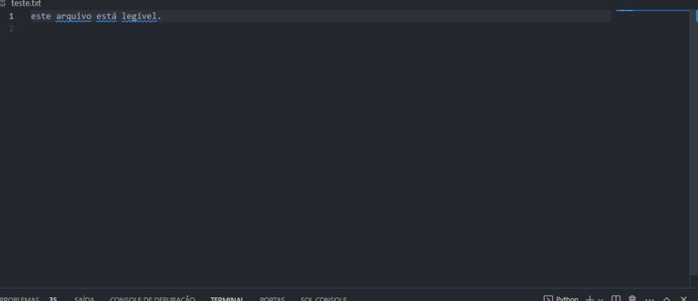
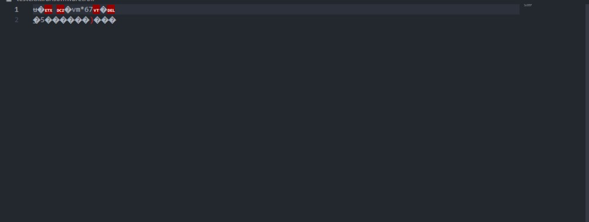

# Desafio Dio: Ransonware com Python

### Ferramentas:

- Python: Python é uma linguagem de programação de alto nível, interpretada de script, imperativa, orientada a objetos, funcional, de tipagem dinâmica e forte. Foi lançada por Guido van Rossum em 1991. Atualmente, possui um modelo de desenvolvimento comunitário, aberto e gerenciado pela organização sem fins lucrativos Python Software Foundation.
  
- Pyaes: Uma implementação puramente Python do algoritmo de cifragem de blocos AES (FIPS-197) e modos comuns de operação (CBC, CFB, CTR, ECB, OFB) sem dependências além das bibliotecas Python padrão.
  
- OS: Este módulo fornece uma forma portátil de usar a funcionalidade dependente do sistema operativo.

### Observações:

- 1- Utilizei o arquivo **encript.py** para criptografar as informações do arquivo **teste.txt**
  
  Exemplo:
    
    * Antes do algoritmo ser executado.
  
    

    * Após o algoritmo ser executado.
    
    

- 2- O algoritmo também muda a extenção do arquivo, fazendo com que ele fique inacessível. 

- 3- O arquivo **decript.py**, faz com que o arquivo seja descriptografado e retorne ao seu estado original.
  
